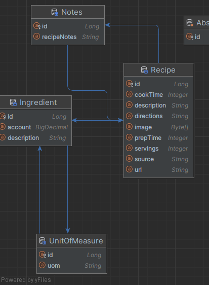
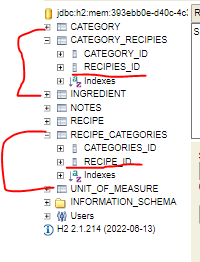
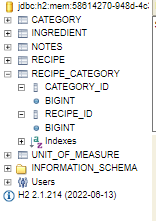
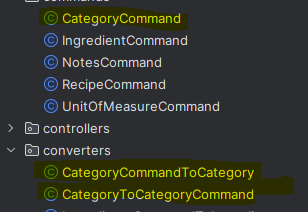
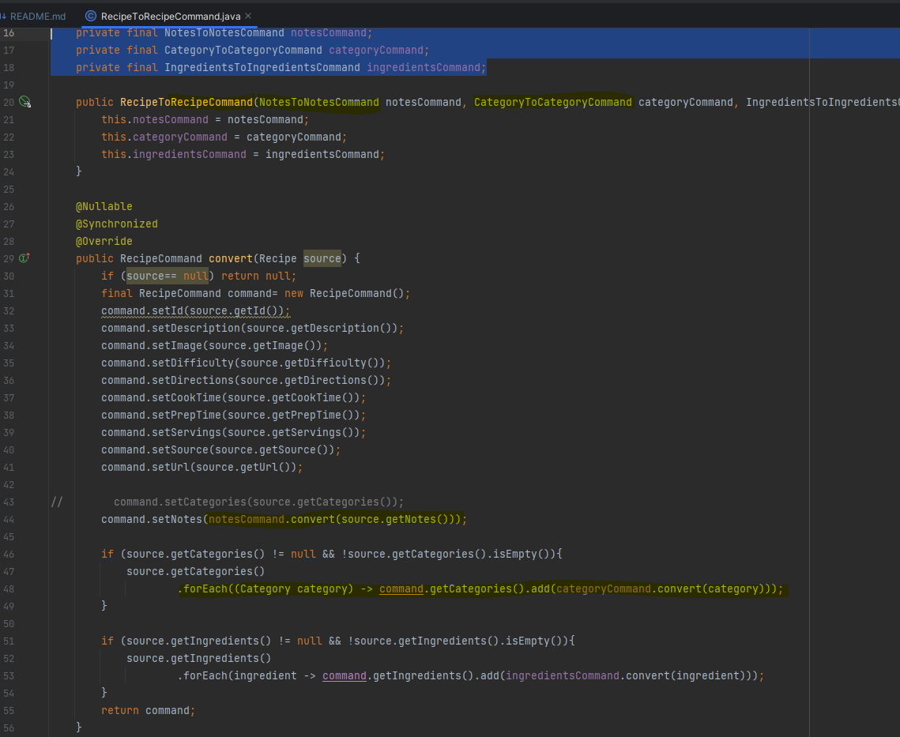

# JPA
### Entity diagram 1.0

Please remember:
* [JDL STUDIO](https://www.jhipster.tech/jdl-studio/)
* or intelij show entity relationships diagram:



----------------
### @manyToMany
- creates new db for each annotation so w have to config it.
- please note singulars and plurals


```java
@Entity
public class Recipe {
    @ManyToMany
    @JoinTable(name = "recipe_category",
            joinColumns = @JoinColumn(name= "recipe_id"),
            inverseJoinColumns = @JoinColumn(name= "category_id")
    )
    private Set<Category> categories;
    ...----...
    @Entity
    public class Category {
    @ManyToMany(mappedBy = "categories")
    private Set<Recipe> recipies;
```
- will result in only 1 mapped table


------------------

### Spring datasource initialization
[docs pdf](https://github.com/friedelredward/mvc-recipies/blob/main/DatabaseInitializationWithSpring.pdf)
- DDL : data def language
- DML : data manipulation langguage
- hibernate feature: `spring.jpa.hibernate.dl-auto` : none, validate(prod)(fails on smth missing), 
  - update(use with caution, this not good for prod),
  - create(initial db creation)
  - create-drop(when app down the db with get dropped)(used for h2, hsql, and derby in mem DB)
  - can b autocreated if in import.sql
- as alternative there is Spring DataSource initializer(conflict
with hibernate ddl-auto!!! beware)
- by default Sboot wil load from `schema.sql` and ``data.sql``

```properties
#Important note : application.properties::
#very necesary because default behavior has changed.
#init sql scripts now execute before hibernate init so theres no db
spring.jpa.defer-datasource-initialization=true
spring.sql.init.mode=always
spring.datasource.generate-unique-name=false
## do not use in prod"!!!
spring.jpa.hibernate.ddl-auto=create-drop

```
- Also please make sure slq statements match given model -.-
- also h2 unless in server mode doesnt accept more than 1 conection:
so conecting it **from the IDE might not work at all**.

--------
### Finders (_fyndByProperty_name()_)
- Remember it's a naming convention and the plumbing and the hardlifting
 will be done for us by the framework in the background.
- We simply declare it in the interface. no sql needed (spring data jpa for the win)
- check CategoryRepository

### mock mvc
Don't need to bring the full spring context for controllers
````MockMvc mockMvc= MockMvcBuilders.standaloneSetup(indexController).build();````

````java
    //still a unit test for MVC!!!!! pej
    @Test
    void testMockMVC() throws Exception {
        MockMvc mockMvc= MockMvcBuilders.standaloneSetup(indexController).build();

        mockMvc.perform(MockMvcRequestBuilders.get("/"))
                .andExpect(status().isOk())
                .andExpect(view().name("index"));
    }
````

### Maven Failsafe plugin

- Needed to be configured with the IT convention for integration test to be run
````yaml
<plugin>
                <groupId>org.apache.maven.plugins</groupId>
                <artifactId>maven-failsafe-plugin</artifactId>
                <configuration>
                    <includes>
                        <include>**/*IT.java</include>
                    </includes>
                    <additionalClasspathElements>
                        <additionalClasspathElement>${basedir}/target/classes</additionalClasspathElement>
                    </additionalClasspathElements>
                    <parallel>none</parallel>
                </configuration>
                <executions>
                    <execution>
                        <goals>
                            <goal>integration-test</goal>
                            <goal>verify</goal>
                        </goals>
                    </execution>
                </executions>
            </plugin>
````
- means that in the verify step will execute the integration tests
- also the path is necessary because a bug, so it sees all tests.

### Circle CI integration

- it alone creates the necesarry webhook + deploy ssh key

---------

### JUnit5
[IntroToJUnit5 pdf](https://github.com/friedelredward/mvc-recipies/blob/main/IntroToJUnit5.pdf)

----

### WebJars 
- Jars files of popular web components

### COmmand object for databinding in spring forms
- Command Pojos need 2 converters for translating data from entities to commands and back.
  pej: 
- Beware nested converters: a converter for a nested entity will use nested object converter!!
pej: 

