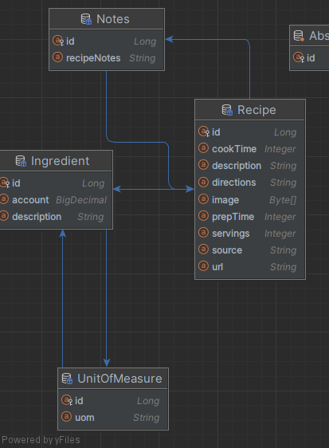
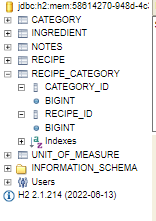

### Entity diagram 1.0

Please remember:
* [JDL STUDIO](https://www.jhipster.tech/jdl-studio/)
* or intelij show entity relationships diagram:



----------------
### @manyToMany
- creates new db for each annotation so w have to config it.
- please note singulars and plurals


```java
@Entity
public class Recipe {
    @ManyToMany
    @JoinTable(name = "recipe_category",
            joinColumns = @JoinColumn(name= "recipe_id"),
            inverseJoinColumns = @JoinColumn(name= "category_id")
    )
    private Set<Category> categories;
    ...----...
    @Entity
    public class Category {
    @ManyToMany(mappedBy = "categories")
    private Set<Recipe> recipies;
```
- will result in only 1 mapped table
